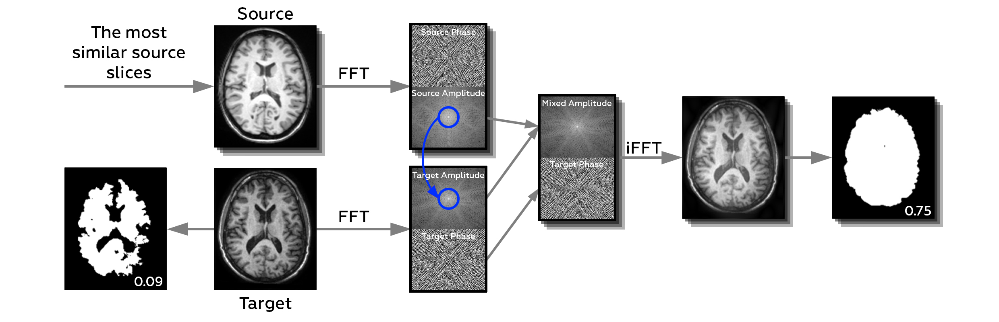

Hello! :vulcan_salute:

Here is the code for paper "Feather-Light Fourier Domain Adaptation"



## Setting up the Libraries:

##### 1. Install the `kswap` module:
```
git clone https://github.com/neuro-ml/domain_shift_anatomy.git
cd domain_shift_anatomy
pip install -e .
``` 

##### 2. Check your Python & various packages versions: 
```
1) Python 3.8.10
2) PyTorch 1.10.0
3) dpipe 0.1.0
4) piq 0.6.0
```

## Reproducing the results

### 0. Perform scans registration 
Refer to `notebooks/registration.ipynb` for guidance

### 1. Baseline and Oracle (see section 4.2 of the paper)
You may find the corresponding configs in the folder `configs/experiments/baseline`. To run an experiment, you should first create its structure via 
```
dpipe-build /path/to/the/config.config /path/to/the/experiment/
```

Then to run it please go to a folder inside the created structure (`i` corresponds to a particular sub-experiment, i.e. to a particular base domain in case of the baseline calculations):
```
cd ~/path/to/the/experiment/experiment_{i}/
```

and call the following command:

```
dpipe-run ../resources.config
```
The corresponding results are analyzed @ `notebooks/results_baseline`.

### 2. Generating source-target slices "closeness" dictionaries  (see section 3 of the paper)

First of all, you will need the split, defining the scans of interest for each domain. You may find it in the notebook folder along with code for its generation. For figuring out the closest scans pairs, please refer to `notebooks/closest_scans`.


### 3. Fourier Domain Adaptation  

You may run the validation Set experiments (see section 4.3 of the paper) via calling `python configs/experiments/fda/val.py`. Note that you should set `closest_scans_mode` to one of the values: '2d', '3d', '25d' or None, depending on the desired closest source slices picking strategy. You may also set the range of `betas` and `n_scans` to be studied

Based on the validation results, we reveal the list of the optimal Betas (see `notebooks/results_fda; 'sDice(beta); n=7' section`. One may use these beta values to reproduce the final test set results (`python configs/experiments/fda/test.py`), which are also analysed @ `notebooks/results_fda`

### 4.Calculating baselines.

In order to calculate the metrics you need to run the file eval.py. 
It is required to have a directory with weights, where weights for models are stored (#TODO do it from the script). 
It is also required to have a directory with GAN results, which should be stored in `predictions/StyleGan` and in `predictions/cyclegan` (#TODO do it with the script). 

A splits_settings directory in the following format is also required:
`split_settings/{domain_name}/test_t_ids.json` and `split_settings/{domain_name}/val_t_ids.json`. 
These files store the split into val and test selections (can be found in the `notebooks/split` directory).
The result will be a csv file containing the dataframe with the results.

The code responsible for the generation of Gans can be found in the GAN_exps directory (More details to follow in a little while).